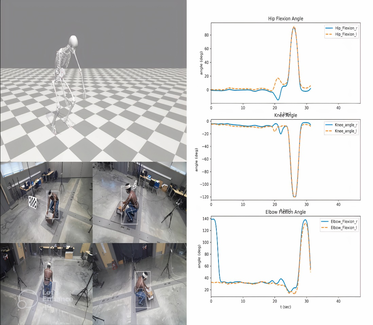

Greetings, I'm Jesudara Omidokun, but you can call me Dara. Currently in my inaugural year as a Ph.D. student (since 2024) within the Department of Industrial and Manufacturing Systems Engineering at the University of Michigan Dearborn, I am under the mentorship of Professor [Bochen Jia](http://www./). My research primarily centers around the intersection of human ergonomics and 3D vision, encompassing areas such as 3D human reconstruction, animation, and generation. My academic pursuits also extend to the fascinating realm of robotics, specifically focusing on connected vehicles and self-driving technology.

Beyond academia, I possess a profound passion for chess, reflecting my strategic and analytical mindset. As a dedicated and enthusiastic individual, I am eager to contribute my skills and knowledge to innovative projects, and I am actively seeking opportunities for collaboration and sponsorship to further propel my academic and research endeavors.

## Background

<table style="width:100%;border:none;border-spacing:0px;border-collapse:separate;margin-right:auto;margin-left:auto;font-size: large">
<tr>
<td style="padding:20px;width:25%;vertical-align:middle;border:none" align="center">
 
</td>
<td style="padding:20px;width:75%;vertical-align:middle;border: none" align="left">
Ph.D. Student. Sep. 2024 - Jun. 2028 (Expected) 
<a href="https://umdearborn.edu/cecs">Department of IMSE</a> 
<a href="https://umdearborn.edu">University of Michigan-Dearborn</a> 
</td>
</tr>
<tr>
<td style="padding:20px;width:25%;vertical-align:middle;border:none" align="center">
 
</td>
<td style="padding:20px;width:75%;vertical-align:middle;border: none" align="left">
Master of Science in Engineering. Sep. 2020 - Jun. 2022 
<a href="https://umdearborn.edu/cecs"><b>College of Electrical and Compter Science</b></a> 
<a href="https://umdearborn.edu/cecs"><b>Department of Electrical and Computer Engineering</b></a>   
<a href="https://wwwcp.umes.edu/">University of Michigan-Dearborn</a> 
</td>
</tr>
<tr>
<td style="padding:20px;width:25%;vertical-align:middle;border:none" align="center">
 
</td>
<td style="padding:20px;width:75%;vertical-align:middle;border: none" align="left">
Bachelor of Science in Engineering. Sep. 2015 - Jun. 2019 
<a href="https://wwwcp.umes.edu/engineering/"><b>Department of Engineering</b></a> 
<a href="https://wwwcp.umes.edu/">University of Maryland Eastern Shore</a> 
</td>
</tr>
</table>

## Research
<table style="border-collapse: collapse; border: none;">
  <tr>
    <td></td>
    <td>
      

        <b>Leveraging Digital Perceptual Technologies for Remote Perception and Analysis of Human Biomechanical Processes: A Contactless Approach for Workload and Joint Force Assessment</b> 
        <i>J. Omidokun, D. Egeonu, B. Jia, L. Yang</i> 
        2024  
        This study presents an innovative computer vision framework designed to analyze human movements in industrial settings, aiming to enhance biomechanical analysis by integrating seamlessly with existing software. Through a combination of advanced imaging and modeling techniques, the framework allows for comprehensive scrutiny of human motion, providing valuable insights into kinematic patterns and kinetic data.......  
        <a href="webpage-link"><svg class="svg-inline--fa fa-globe-asia fa-w-16" aria-hidden="true" data-prefix="fas" data-icon="globe-asia" role="img" xmlns="http://www.w3.org/2000/svg" viewBox="0 0 496 512" style="width:20px;height:20px;"> <path fill="currentColor" d="M248 8C111.03 8 0 119.03 0 256s111.03 248 248 248 248-111.03 248-248S384.97 8 248 8zm-11.34 240.23c-2.89 4.82-8.1 7.77-13.72 7.77h-.31c-4.24 0-8.31 1.69-11.31 4.69l-5.66 5.66c-3.12 3.12-3.12 8.19 0 11.31l5.66 5.66c3 3 4.69 7.07 4.69 11.31V304c0 8.84-7.16 16-16 16h-6.11c-6.06 0-11.6-3.42-14.31-8.85l-22.62-45.23c-2.44-4.88-8.95-5.94-12.81-2.08l-19.47 19.46c-3 3-7.07 4.69-11.31 4.69H50.81C49.12 277.55 48 266.92 48 256c0-110.28 89.72-200 200-200 21.51 0 42.2 3.51 61.63 9.82l-50.16 38.53c-5.11 3.41-4.63 11.06.86 13.81l10.83 5.41c5.42 2.71 8.84 8.25 8.84 14.31V216c0 4.42-3.58 8-8 8h-3.06c-3.03 0-5.8-1.71-7.15-4.42-1.56-3.12-5.96-3.29-7.76-.3l-17.37 28.95zM408 358.43c0 4.24-1.69 8.31-4.69 11.31l-9.57 9.57c-3 3-7.07 4.69-11.31 4.69h-15.16c-4.24 0-8.31-1.69-11.31-4.69l-13.01-13.01a26.767 26.767 0 0 0-25.42-7.04l-21.27 5.32c-1.27.32-2.57.48-3.88.48h-10.34c-4.24 0-8.31-1.69-11.31-4.69l-11.91-11.91a8.008 8.008 0 0 1-2.34-5.66v-10.2c0-3.27 1.99-6.21 5.03-7.43l39.34-15.74c1.98-.79 3.86-1.82 5.59-3.05l23.71-16.89a7.978 7.978 0 0 1 4.64-1.48h12.09c3.23 0 6.15 1.94 7.39 4.93l5.35 12.85a4 4 0 0 0 3.69 2.46h3.8c1.78 0 3.35-1.18 3.84-2.88l4.2-14.47c.5-1.71 2.06-2.88 3.84-2.88h6.06c2.21 0 4 1.79 4 4v12.93c0 2.12.84 4.16 2.34 5.66l11.91 11.91c3 3 4.69 7.07 4.69 11.31v24.6z"></path></svg> Webpage</a>|
        <a href="paper-link"><svg class="svg-inline--fa fa-copy fa-w-14" aria-hidden="true" data-prefix="fas" data-icon="copy" role="img" xmlns="http://www.w3.org/2000/svg" viewBox="0 0 496 512" style="width:20px;height:20px;"><path fill="currentColor" d="M320 448v40c0 13.255-10.745 24-24 24H24c-13.255 0-24-10.745-24-24V120c0-13.255 10.745-24 24-24h72v296c0 30.879 25.121 56 56 56h168zm0-344V0H152c-13.255 0-24 10.745-24 24v368c0 13.255 10.745 24 24 24h272c13.255 0 24-10.745 24-24V128H344c-13.2 0-24-10.8-24-24zm120.971-31.029L375.029 7.029A24 24 0 0 0 358.059 0H352v96h96v-6.059a24 24 0 0 0-7.029-16.97z"></path></svg> Paper</a> |
        <a href="video-link"><svg class="svg-inline--fa fa-film fa-w-16" aria-hidden="true" data-prefix="fas" data-icon="film" role="img" xmlns="http://www.w3.org/2000/svg" viewBox="0 0 496 512" style="width:20px;height:20px;"><path fill="currentColor" d="M488 64h-8v20c0 6.6-5.4 12-12 12h-40c-6.6 0-12-5.4-12-12V64H96v20c0 6.6-5.4 12-12 12H44c-6.6 0-12-5.4-12-12V64h-8C10.7 64 0 74.7 0 88v336c0 13.3 10.7 24 24 24h8v-20c0-6.6 5.4-12 12-12h40c6.6 0 12 5.4 12 12v20h320v-20c0-6.6 5.4-12 12-12h40c6.6 0 12 5.4 12 12v20h8c13.3 0 24-10.7 24-24V88c0-13.3-10.7-24-24-24zM96 372c0 6.6-5.4 12-12 12H44c-6.6 0-12-5.4-12-12v-40c0-6.6 5.4-12 12-12h40c6.6 0 12 5.4 12 12v40zm0-96c0 6.6-5.4 12-12 12H44c-6.6 0-12-5.4-12-12v-40c0-6.6 5.4-12 12-12h40c6.6 0 12 5.4 12 12v40zm0-96c0 6.6-5.4 12-12 12H44c-6.6 0-12-5.4-12-12v-40c0-6.6 5.4-12 12-12h40c6.6 0 12 5.4 12 12v40zm272 208c0 6.6-5.4 12-12 12H156c-6.6 0-12-5.4-12-12v-96c0-6.6 5.4-12 12-12h200c6.6 0 12 5.4 12 12v96zm0-168c0 6.6-5.4 12-12 12H156c-6.6 0-12-5.4-12-12v-96c0-6.6 5.4-12 12-12h200c6.6 0 12 5.4 12 12v96zm112 152c0 6.6-5.4 12-12 12h-40c-6.6 0-12-5.4-12-12v-40c0-6.6 5.4-12 12-12h40c6.6 0 12 5.4 12 12v40zm0-96c0 6.6-5.4 12-12 12h-40c-6.6 0-12-5.4-12-12v-40c0-6.6 5.4-12 12-12h40c6.6 0 12 5.4 12 12v40zm0-96c0 6.6-5.4 12-12 12h-40c-6.6 0-12-5.4-12-12v-40c0-6.6 5.4-12 12-12h40c6.6 0 12 5.4 12 12v40z"></path></svg> Video</a> |
        <a href="code-link"><svg class="svg-inline--fa fa-code fa-w-20" aria-hidden="true" data-prefix="fas" data-icon="code" role="img" xmlns="http://www.w3.org/2000/svg" viewBox="0 0 640 512"  style="width:20px;height:20px;"><path fill="currentColor" d="M278.9 511.5l-61-17.7c-6.4-1.8-10-8.5-8.2-14.9L346.2 8.7c1.8-6.4 8.5-10 14.9-8.2l61 17.7c6.4 1.8 10 8.5 8.2 14.9L293.8 503.3c-1.9 6.4-8.5 10.1-14.9 8.2zm-114-112.2l43.5-46.4c4.6-4.9 4.3-12.7-.8-17.2L117 256l90.6-79.7c5.1-4.5 5.5-12.3.8-17.2l-43.5-46.4c-4.5-4.8-12.1-5.1-17-.5L3.8 247.2c-5.1 4.7-5.1 12.8 0 17.5l144.1 135.1c4.9 4.6 12.5 4.4 17-.5zm327.2.6l144.1-135.1c5.1-4.7 5.1-12.8 0-17.5L492.1 112.1c-4.8-4.5-12.4-4.3-17 .5L431.6 159c-4.6 4.9-4.3 12.7.8 17.2L523 256l-90.6 79.7c-5.1 4.5-5.5 12.3-.8 17.2l43.5 46.4c4.5 4.9 12.1 5.1 17 .6z"></path></svg> Code</a> |
        <a href="bibtex-link"><svg class="svg-inline--fa fa-bookmark fa-w-12" aria-hidden="true" data-prefix="fas" data-icon="bookmark" role="img" xmlns="http://www.w3.org/2000/svg" viewBox="0 0 384 512" style="width:20px;height:20px;"><path fill="currentColor" d="M0 512V48C0 21.49 21.49 0 48 0h288c26.51 0 48 21.49 48 48v464L192 400 0 512z"></path></svg> Bibtex</a>
      

    </td>
  </tr>
</table>

## Others

[X] Skills

  * C++ (OpenCV, OpenGL, CUDA, Eigen, PCL, Qt, ...)
  * Python (Tensorflow/PyTorch)
  * Matlab, C
  * LaTex
[X] Languages

  * English (TOEFL: 104; GRE: 150+168+4.5)
  * French
  * IELTS
