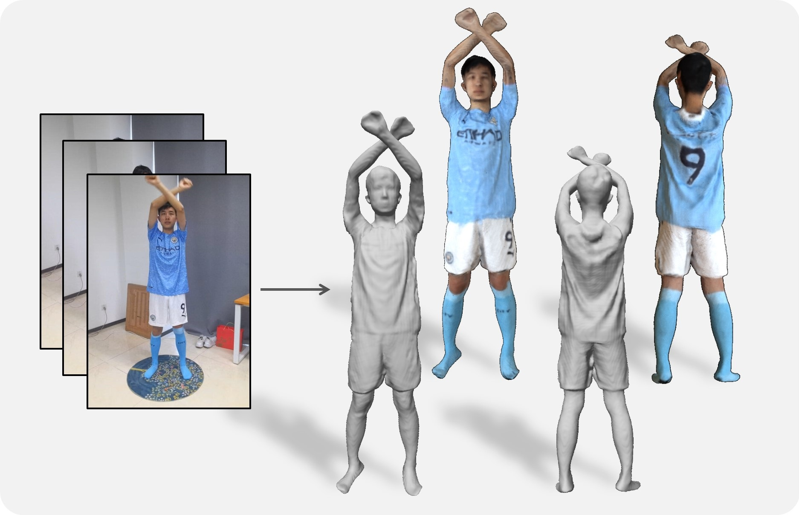
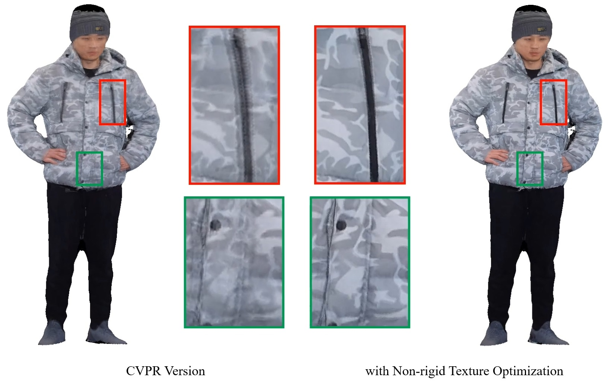
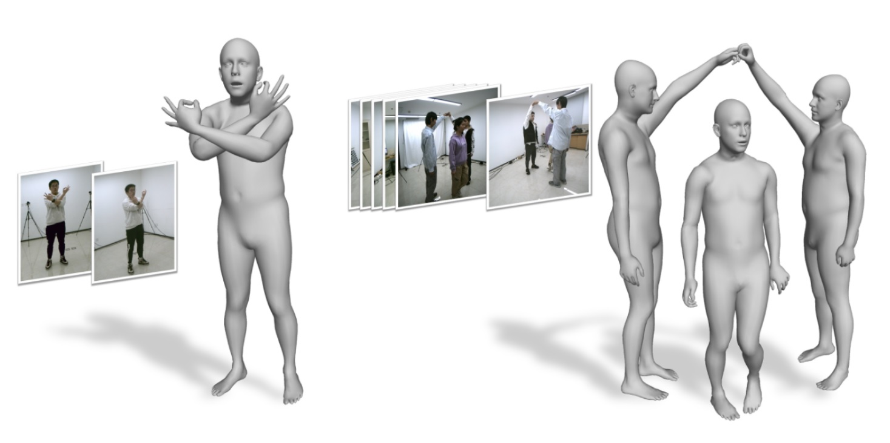
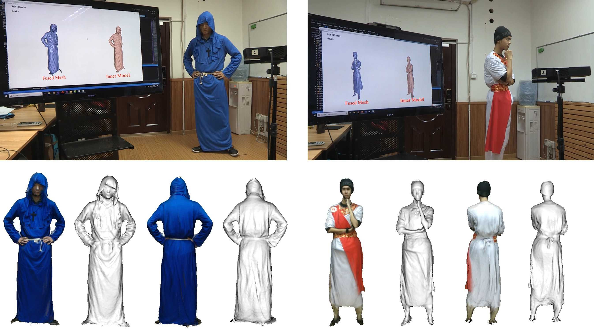

Greetings, I'm Jesudara Omidokun, but you can call me Dara. Currently in my inaugural year as a Ph.D. student (since 2024) within the Department of Industrial and Manufacturing Systems Engineering at the University of Michigan Dearborn, I am under the mentorship of Professor [Bochen Jia](http://www./). My research primarily centers around the intersection of human ergonomics and 3D vision, encompassing areas such as 3D human reconstruction, animation, and generation. My academic pursuits also extend to the fascinating realm of robotics, specifically focusing on connected vehicles and self-driving technology.

Beyond academia, I possess a profound passion for chess, reflecting my strategic and analytical mindset. As a dedicated and enthusiastic individual, I am eager to contribute my skills and knowledge to innovative projects, and I am actively seeking opportunities for collaboration and sponsorship to further propel my academic and research endeavors.

## Background

<table style="width:100%;border:none;border-spacing:0px;border-collapse:separate;margin-right:auto;margin-left:auto;font-size: large">
<tr>
<td style="padding:20px;width:25%;vertical-align:middle;border:none" align="center">
 
</td>
<td style="padding:20px;width:75%;vertical-align:middle;border: none" align="left">
Ph.D. Student. Sep. 2024 - Jun. 2028 (Expected) 
<a href="https://umdearborn.edu/cecs">Department of IMSE</a> 
<a href="https://umdearborn.edu">University of Michigan-Dearborn</a> 
</td>
</tr>
<tr>
<td style="padding:20px;width:25%;vertical-align:middle;border:none" align="center">
 
</td>
<td style="padding:20px;width:75%;vertical-align:middle;border: none" align="left">
Master of Science in Engineering. Sep. 2020 - Jun. 2022 
<a href="https://umdearborn.edu/cecs"><b>College of Electrical and Compter Science</b></a> 
<a href="https://umdearborn.edu/cecs"><b>Department of Electrical and Computer Engineering</b></a>   
<a href="https://wwwcp.umes.edu/">University of Michigan-Dearborn</a> 
</td>
</tr>
<tr>
<td style="padding:20px;width:25%;vertical-align:middle;border:none" align="center">
 
</td>
<td style="padding:20px;width:75%;vertical-align:middle;border: none" align="left">
Bachelor of Science in Engineering. Sep. 2015 - Jun. 2019 
<a href="https://wwwcp.umes.edu/engineering/"><b>Department of Engineering</b></a> 
<a href="https://wwwcp.umes.edu/">University of Maryland Eastern Shore</a> 
</td>
</tr>
</table>

## Research

<!-- 

<table style="width:100%;border:none;border-spacing:0px;border-collapse:separate;margin-right:auto;margin-left:auto;font-size: large">
<tr>
<td style="padding:20px;width:30%;vertical-align:middle;border:none" align="center">

</td>
<td style="padding:20px;width:70%;vertical-align:middle;border: none" align="left">
<b>AvatarCap: Animatable Avatar Conditioned Monocular Human Volumetric Capture</b> 
<b>Zhe Li</b>, Zerong Zheng, Hongwen Zhang, Chaonan Ji, Yebin Liu 
<i>European Conference on Computer Vision (<b>ECCV</b>), 2022</i> 
<a href="http://www.liuyebin.com/avatarcap/avatarcap.html"><i class="fas fa-fw fa-globe"></i>Projectpage</a> /
<a href="https://arxiv.org/pdf/2207.02031.pdf"><i class="fas fa-fw fa-file-pdf"></i>Paper</a> /
<a href="http://www.liuyebin.com/avatarcap/assets/supp_video.mp4"><i class="fas fa-fw fa-video"></i>Video</a> /
<a href="https://github.com/lizhe00/AvatarCap"><i class="fab fa-fw fa-github fa-github"></i>Code</a>
</td>
</tr>
</table>

 -->

---

<!-- 

<table style="width:100%;border:none;border-spacing:0px;border-collapse:separate;margin-right:auto;margin-left:auto;font-size: large">
<tr>
<td style="padding:20px;width:30%;vertical-align:middle;border:none" align="center">

</td>
<td style="padding:20px;width:70%;vertical-align:middle;border: none" align="left">
<b>Robust and Accurate 3D Self-portraits in Seconds</b> 
<b>Zhe Li</b>, Tao Yu, Zerong Zheng, Yebin Liu 
<i>IEEE Transactions on Pattern Analysis and Machine Intelligence (<b>T-PAMI</b>), 2021</i> 
<a href="http://www.liuyebin.com/portrait/portrait.html"><i class="fas fa-fw fa-globe"></i>Projectpage</a> /
<a href="https://ieeexplore.ieee.org/document/9540284/"><i class="fas fa-fw fa-file-pdf"></i>Paper</a>
</td>
</tr>
</table>

 -->

---

<!-- 

<table style="width:100%;border:none;border-spacing:0px;border-collapse:separate;margin-right:auto;margin-left:auto;font-size: large">
<tr>
<td style="padding:20px;width:30%;vertical-align:middle;border:none" align="center">

</td>
<td style="padding:20px;width:70%;vertical-align:middle;border: none" align="left">
<b>POSEFusion: Pose-guided Selective Fusion for Single-view Human Volumetric Capture</b> 
<b>Zhe Li</b>, Tao Yu, Zerong Zheng, Kaiwen Guo, Yebin Liu 
<i>IEEE Conference on Computer Vision and Pattern Recognition (<b>CVPR</b>), 2021</i>  (Oral presentation) 
<a href="http://www.liuyebin.com/posefusion/posefusion.html"><i class="fas fa-fw fa-globe"></i>Projectpage</a> /
<a href="https://arxiv.org/pdf/2103.15331.pdf"><i class="fas fa-fw fa-file-pdf"></i>Paper</a> /
<a href="http://www.liuyebin.com/posefusion/assets/supp_video.mp4"><i class="fas fa-fw fa-video"></i>Video</a> /
<a href="https://youtu.be/34jrPLkiPrw"><i class="fas fa-fw fa-video"></i>Talk</a> 
</td>
</tr>
</table>

 -->

---

<!-- 

<table style="width:100%;border:none;border-spacing:0px;border-collapse:separate;margin-right:auto;margin-left:auto;font-size: large">
<tr>
<td style="padding:20px;width:30%;vertical-align:middle;border:none" align="center">

</td>
<td style="padding:20px;width:70%;vertical-align:middle;border: none" align="left">
<b>Lightweight Multi-person Total Motion Capture Using Sparse Multi-view Cameras</b> 
Yuxiang Zhang, <b>Zhe Li</b>, Liang An, Mengcheng Li, Tao Yu, Yebin Liu 
<i>IEEE International Conference on Computer Vision (<b>ICCV</b>), 2021</i> 
<a href="http://www.liuyebin.com/lwtotalcap/lwtotalcap.html"><i class="fas fa-fw fa-globe"></i>Projectpage</a> /
<a href="https://arxiv.org/pdf/2108.10378.pdf"><i class="fas fa-fw fa-file-pdf"></i>Paper</a> /
<a href="http://www.liuyebin.com/lwtotalcap/assets/video.mp4"><i class="fas fa-fw fa-video"></i>Video</a>
</td>
</tr>
</table>

 -->

---

<!-- 

<table style="width:100%;border:none;border-spacing:0px;border-collapse:separate;margin-right:auto;margin-left:auto;font-size: large">
<tr>
<td style="padding:20px;width:30%;vertical-align:middle;border:none" align="center">

</td>
<td style="padding:20px;width:70%;vertical-align:middle;border: none" align="left">
<b>Robust 3D Self-portraits in Seconds</b> 
<b>Zhe Li</b>, Tao Yu, Chuanyu Pan, Zerong Zheng, Yebin Liu 
<i>IEEE Conference on Computer Vision and Pattern Recognition (<b>CVPR</b>), 2020</i>  (Oral presentation) 
<a href="http://www.liuyebin.com/portrait/portrait.html"><i class="fas fa-fw fa-globe"></i>Projectpage</a> /
<a href="http://openaccess.thecvf.com/content_CVPR_2020/papers/Li_Robust_3D_Self-Portraits_in_Seconds_CVPR_2020_paper.pdf"><i class="fas fa-fw fa-file-pdf"></i>Paper</a> /
<a href="http://www.liuyebin.com/portrait/assets/portrait.mp4"><i class="fas fa-fw fa-video"></i>Video</a> /
<a href="https://youtu.be/nx-pzk12hLY"><i class="fas fa-fw fa-video"></i>Talk</a> 
</td>
</tr>
</table>

 -->

## Award

<table style="width:100%;border:none;border-spacing:0px;border-collapse:separate;margin-right:auto;margin-left:auto;font-size: large">
<tr>
<td style="padding:10px;width:25%;vertical-align:middle;border:none" align="center">2022
</td>
<td style="padding:20px;width:75%;vertical-align:middle;border: none" align="left">
<b>Double Tabs Achievements 1</b>
</td>
</tr>
<tr>
<td style="padding:20px;width:25%;vertical-align:middle;border:none" align="center">
2023
</td>
<td style="padding:20px;width:75%;vertical-align:middle;border: none" align="left">
<b>Double Tabs Achievements 2</b> 
<b>Double Tabs Achievements 3</b>  
<b>Double Tabs Achievements 3</b>  
<b>Double Tabs Achievements 3</b>   
</td>
</tr>
</table>

## Others

<h4>Skills</h4>

<ul style="line-height: 2rem; font-size: small;">
<li>C++ (OpenCV, OpenGL, CUDA, Eigen, PCL, Qt, ...)</li>
<li>Python (Tensorflow/PyTorch)</li>
<li>Matlab, C#</li>
<li>LaTex</li>
</ul>
<h4>Languages</h4>

<ul style="line-height: 2rem; font-size: small;">
<li>English (TOEFL: 104; GRE: 148+168+4.0)</li>
<li>French </li>
</ul>

## Contact

Email: jomidoku@umich.edu 
Phone: 313

