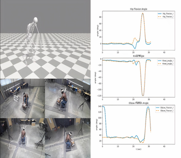
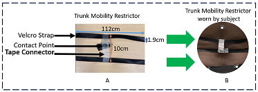
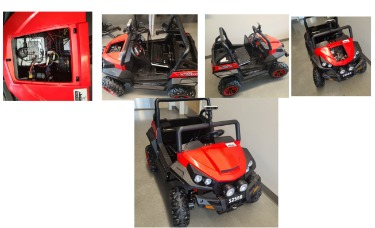

# Human-Centered AI for Intelligent Transportation and Ergonomics

Hello, I'm **Jesudara Omidokun** — you can call me **Dara**. I am a Ph.D. student in **Industrial and Manufacturing Systems Engineering** at the **University of Michigan–Dearborn**, advised by Professor **Bochen Jia**.

My work focuses on how people interact with intelligent technologies. I combine **human factors engineering**, **machine learning**, **computer vision**, **statistical modeling**, and **physiological/behavioral sensing** to study trust, safety, workload, and user experience in automated and data-driven systems.

My long-term goal is to develop **human-centered intelligent systems** that can understand human behavior, adapt to user needs, and support safer interaction with technologies such as automated vehicles, human-machine interfaces, wearable systems, and digital human models.

**Current research focus:** Human Digital Twins and adaptive transparency for automated vehicle interaction.

[Research Themes](#research-themes) | [Featured Projects](#featured-projects) | [Research Outputs](#selected-research-outputs) | [Experience](#experience) | [Skills](#skills) | [Contact](#contact)

---

## Research Identity

I describe my research using one central question:

> **How can intelligent systems better understand, support, and adapt to humans in complex environments?**

This question connects my work across automated driving, driver behavior, ergonomics, human motion analysis, and machine-learning-based sensing. Rather than treating these as separate projects, I view them as part of a broader effort to build **human-centered AI systems** that improve safety, trust calibration, and human performance.

---

## Research Themes

### 1. Human-Centered AI and Automated Driving

I study how drivers and occupants understand, trust, and respond to automated vehicle systems. This includes trust transfer across automation levels, driver reliance, adaptive human-machine interfaces, and transparency strategies that help users build accurate mental models of system capability.

**Keywords:** automated vehicles, trust calibration, adaptive transparency, HMI, behavioral reliance, driver monitoring.

### 2. Human Digital Twins and User-State Modeling

I am developing a research direction around **Human Digital Twins** for modeling human states such as trust, workload, attention, posture, and physiological response. The goal is to support intelligent systems that can personalize feedback and transparency based on the user's state and task context.

**Keywords:** human digital twin, physiological sensing, cognitive load, trust, user modeling, adaptive systems.

### 3. Computer Vision and Biomechanical Assessment

My earlier work uses computer vision, digital human modeling, and motion analysis to support ergonomic and biomechanical assessment. This includes contactless human motion analysis, workload estimation, joint force assessment, and ground reaction force estimation using machine learning.

**Keywords:** computer vision, 3D human reconstruction, pose estimation, ergonomics, biomechanics, motion analysis.

### 4. Data-Driven Human Factors and Experimental Analytics

Across projects, I use experimental design and statistical modeling to analyze human behavior and system performance. My interests include mixed-effects modeling, regression, structural equation modeling, machine learning pipelines, and interpretable analysis for human-subject studies.

**Keywords:** statistics, experimental design, mixed-effects models, SEM, Python, MATLAB, behavioral data analysis.

---

## Current Work

I am currently working on several connected research and professional-development efforts:

- **Human Digital Twin for Automated Vehicle Interaction:** developing a dissertation direction around adaptive transparency, trust calibration, and human-state modeling across different automation levels.
- **Trust Transfer in Automated Driving:** studying how users transfer trust between automation levels and interface designs, especially during Level 2 and Level 3 system transitions.
- **Driver Behavior and PDA/ADAS Analytics:** analyzing gaze, vehicle control, and behavioral measures to understand how drivers interact with proactive and automated driving assistance systems.
- **FitCheck Ergonomic Chair Study:** supporting data processing and analysis pipelines for ergonomic chair assessment using pressure mapping and behavioral/subjective measures.
- **Teaching and Technical Communication:** developing probability and statistics teaching materials, summary sheets, and problem-solving guides for engineering students.

---

## Featured Projects

### Human Digital Twin for Adaptive Transparency in Automated Vehicles

**Problem.** Automated vehicle users often struggle to understand system capability, responsibility, and limitations across automation levels.

**Approach.** I am exploring how human digital twin models can combine behavioral, subjective, and physiological indicators to support adaptive transparency and improve trust calibration.

**Methods.** Human factors theory, trust modeling, physiological sensing, survey design, statistical modeling, and human-machine interface evaluation.

**Status.** Dissertation research direction in development.

---

### Trust Transfer Across Automation Levels

**Problem.** When a driver moves between different automation levels or interface designs, trust can be overestimated, underestimated, or transferred inappropriately.

**Approach.** This project examines how HMI similarity, perceived continuity, mental models, and responsibility attribution influence trust transfer between automated driving modes.

**Methods.** Experimental survey design, trust and acceptance measures, structural equation modeling, behavioral reliance measures, and transition-comprehension checks.

**Status.** Active research project.

---

### Data-Driven Driver Behavior and ADAS Analysis

**Problem.** Automated and assisted driving systems require careful evaluation of driver attention, interaction patterns, and control behavior.

**Approach.** I analyze vehicle signals, gaze behavior, and assistance-system interactions to understand how drivers use and respond to proactive driving support.

**Methods.** Python/MATLAB data processing, gaze analysis, vehicle-signal analysis, statistical modeling, visualization, and human factors interpretation.

**Status.** Active research analysis pipeline.

---

### FitCheck Ergonomics and Pressure Mapping Pipeline

**Problem.** Ergonomic chair evaluation requires combining subjective comfort ratings, pressure mapping, posture behavior, and participant-level experimental data.

**Approach.** I support data cleaning, dictionary development, and analysis pipelines for chair trials and pressure-mat measurements.

**Methods.** Data cleaning, pressure-map feature extraction, posture-shift metrics, visualization, and statistical summaries.

**Status.** Ongoing collaborative study.

---

### Scaled Autonomous Vehicle Platform

**Problem.** Autonomous driving education and research require flexible platforms where machine-learning-based driving algorithms can be tested safely.

**Approach.** My master's thesis developed a scaled autonomous vehicle platform with drive-by-wire capability, sensing, and deep-learning-based system design.

**Methods.** Embedded systems, C++/Python, computer vision, machine learning, vehicle control, and autonomous-system integration.

**Outputs.** Thesis, video demonstration, and code repository.

---

## Selected Research Outputs

<table style="border-collapse: collapse; border: none;">
  <tr style="border-collapse: collapse; border: none;">
    <td style="border-collapse: collapse; border: none; width: 30%; vertical-align: middle;" align="center">
      
    </td>
    <td style="border-collapse: collapse; border: none; width: 70%; vertical-align: top;">
      <strong>Leveraging Digital Perceptual Technologies for Remote Perception and Analysis of Human Biomechanical Processes</strong> 
      <em>J. Omidokun, D. Egeonu, B. Jia, L. Yang</em> 
      This work develops a contactless computer-vision framework for human motion and biomechanical assessment in industrial contexts. It connects digital perception, motion analysis, and ergonomic evaluation.
        
      <a href="https://jomidokunmain.github.io/Demoweb3/">Webpage</a> |
      <a href="https://www.tandfonline.com/doi/full/10.1080/24725838.2025.2469076">Paper</a> |
      <a href="https://jomidokunmain.github.io/Demoweb3/parent2/leaning.html">Video</a> |
      <a href="https://github.com/jomidokunMain/pose_mech">Code</a> |
      <a href="http://jomidokunMain.github.io/files/tandf_uehf2113_1.bib">BibTeX</a>
    </td>
  </tr>
</table>

<table style="border-collapse: collapse; border: none;">
  <tr style="border-collapse: collapse; border: none;">
    <td style="border-collapse: collapse; border: none; width: 30%; vertical-align: middle;" align="center">
      
    </td>
    <td style="border-collapse: collapse; border: none; width: 70%; vertical-align: top;">
      <strong>Biomechanical Assessment of Exoskeleton Intervention for Injured and Recovering Workers</strong> 
      <em>D. Egeonu, J. Omidokun, B. Jia, L. Yang</em> 
      This study evaluates how passive trunk exoskeleton support may assist workers with limited trunk mobility during simulated bending tasks.
        
      <a href="https://journals.sagepub.com/doi/full/10.1177/10711813241260302">Paper</a> |
      <a href="https://jomidokunmain.github.io/Demoweb3/parent2/bm/fullbend.html">Video</a>
    </td>
  </tr>
</table>

<table style="border-collapse: collapse; border: none;">
  <tr style="border-collapse: collapse; border: none;">
    <td style="border-collapse: collapse; border: none; width: 30%; vertical-align: middle;" align="center">
      
    </td>
    <td style="border-collapse: collapse; border: none; width: 70%; vertical-align: top;">
      <strong>Design and Implementation of an Autonomous Driving System with a Deep Learning Approach on a Scaled Vehicle Platform</strong> 
      <em>J. Omidokun</em> 
      This thesis project developed a scaled autonomous driving platform for research and education, integrating sensing, drive-by-wire control, and machine-learning-based autonomy.
        
      <a href="https://deepblue.lib.umich.edu/handle/2027.42/175269">Thesis</a> |
      <a href="https://www.youtube.com/watch?v=iN4jbnmJ2Cc">Video</a> |
      <a href="https://github.com/jomidokunMain/MROVER.git">Code</a>
    </td>
  </tr>
</table>

### Ground Reaction Force Estimation Through Deep Learning

This project explores the use of machine learning to estimate ground reaction forces from joint-coordinate data captured through motion tracking systems. The broader goal is to support field-applicable ergonomic and biomechanical assessment without relying only on laboratory force plates.

<a href="http://jomidokunMain.github.io/images/webmix.mp4">Video</a>

---

## Experience

### Graduate Research Assistant — University of Michigan–Dearborn

I support human factors, ergonomics, automated driving, and data-driven research projects involving experimental design, data analysis, technical writing, and system evaluation.

### Graduate Student Instructor / Teaching Support

I design and communicate engineering probability and statistics materials, including lecture summaries, annotated notes, practice problems, and student-facing explanations that make statistical concepts easier to understand.

### Automotive R&D Intern — Connected and Automated Vehicle Research

I contributed to autonomous and connected vehicle research involving vehicle systems, data analysis, algorithm development, and technical prototyping.

### IEEE Student Branch Chair — University of Michigan–Dearborn

I support student engagement, technical programming, professional development, and campus outreach through IEEE Student Branch activities.

---

## Teaching and Mentoring

I enjoy translating complex technical ideas into clear learning materials. My teaching interests include probability, statistics, experimental design, data analysis, engineering problem solving, MATLAB, and Python.

Selected teaching interests and materials:

- Engineering probability and statistics
- Probability distributions and random variables
- Statistical modeling and data interpretation
- MATLAB and Python for engineering analysis
- Student summary sheets, annotated notes, and practice problems

---

## Background

<table style="width:100%;border:none;border-spacing:0px;border-collapse:separate;margin-right:auto;margin-left:auto;font-size: large">
<tr>
<td style="padding:20px;width:25%;vertical-align:middle;border:none" align="center">
 
</td>
<td style="padding:20px;width:75%;vertical-align:middle;border: none" align="left">
<strong>Ph.D. Student, Industrial and Manufacturing Systems Engineering</strong> 
Sep. 2024 - Jun. 2028 (Expected) 
<a href="https://umdearborn.edu/cecs">University of Michigan-Dearborn</a> 
</td>
</tr>
<tr>
<td style="padding:20px;width:25%;vertical-align:middle;border:none" align="center">
 
</td>
<td style="padding:20px;width:75%;vertical-align:middle;border: none" align="left">
<strong>Master of Science in Engineering, Electrical and Computer Engineering</strong> 
Sep. 2020 - Jun. 2022 
<a href="https://umdearborn.edu/cecs">University of Michigan-Dearborn</a> 
</td>
</tr>
<tr>
<td style="padding:20px;width:25%;vertical-align:middle;border:none" align="center">
 
</td>
<td style="padding:20px;width:75%;vertical-align:middle;border: none" align="left">
<strong>Bachelor of Science in Engineering</strong> 
Sep. 2015 - Jun. 2019 
<a href="https://wwwcp.umes.edu/engineering/">Department of Engineering</a> 
<a href="https://wwwcp.umes.edu/">University of Maryland Eastern Shore</a> 
</td>
</tr>
</table>

---

## Skills

### Programming and Technical Tools

- Python, MATLAB, C++, C
- Git/GitHub, Jupyter, LaTeX
- Data cleaning, visualization, and reproducible analysis workflows

### Machine Learning and Computer Vision

- PyTorch, TensorFlow, OpenCV
- Human pose estimation and motion analysis
- 3D human reconstruction and computer-vision-based measurement
- Deep-learning model development and evaluation

### Human Factors and Ergonomics

- Human-subject study design
- Automated driving and HMI evaluation
- Trust, reliance, workload, and user-experience measurement
- Eye tracking, gaze behavior, physiological sensing, and pressure mapping

### Statistics and Data Analysis

- Probability and statistical modeling
- Regression, ANOVA, and mixed-effects models
- Structural equation modeling and survey analysis
- Experimental design and interpretation of behavioral data

### Communication and Leadership

- Technical writing and research communication
- Teaching and instructional design
- Student organization leadership
- Cross-disciplinary collaboration

---

## Contact

I am open to research collaboration, internship opportunities, technical projects, and conversations around human-centered AI, automated driving, ergonomics, data-driven human factors, and intelligent transportation systems.

- **Email:** [jomidoku@umich.edu](mailto:jomidoku@umich.edu)
- **GitHub:** [jomidokunMain](https://github.com/jomidokunMain)
- **Google Scholar:** [Profile](https://scholar.google.com/citations?hl=en&user=Nl5sQbEAAAAJ)
- **ORCID:** [0000-0002-0304-7379](https://orcid.org/0000-0002-0304-7379)

---

## Personal Note

Outside of research, I enjoy chess because it reflects how I like to think: strategically, patiently, and with attention to both immediate decisions and long-term structure.
