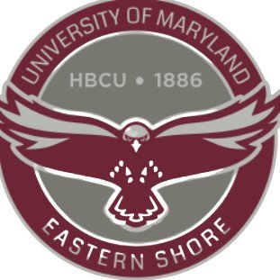

Greetings, I'm Jesudara Omidokun, but you can call me Dara. Currently in my inaugural year as a Ph.D. student (since 2024) within the Department of Industrial and Manufacturing Systems Engineering at the University of Michigan Dearborn, I am under the mentorship of Professor [Bochen Jia](http://www./). My research primarily centers around the intersection of human ergonomics and 3D vision, encompassing areas such as 3D human reconstruction, animation, and generation. My academic pursuits also extend to the fascinating realm of robotics, specifically focusing on connected vehicles and self-driving technology.

Beyond academia, I possess a profound passion for chess, reflecting my strategic and analytical mindset. As a dedicated and enthusiastic individual, I am eager to contribute my skills and knowledge to innovative projects, and I am actively seeking opportunities for collaboration and sponsorship to further propel my academic and research endeavors.

## Background

<table style="width:100%;border:none;border-spacing:0px;border-collapse:separate;margin-right:auto;margin-left:auto;font-size: large">
<tr>
<td style="padding:20px;width:25%;vertical-align:middle;border:none" align="center">
 
</td>
<td style="padding:20px;width:75%;vertical-align:middle;border: none" align="left">
Ph.D. Student. Sep. 2024 - Jun. 2028 (Expected) 
<a href="https://umdearborn.edu/cecs">Department of IMSE</a> 
<a href="https://umdearborn.edu">University of Michigan-Dearborn</a> 
</td>
</tr>
<tr>
<td style="padding:20px;width:25%;vertical-align:middle;border:none" align="center">
 
</td>
<td style="padding:20px;width:75%;vertical-align:middle;border: none" align="left">
Master of Science in Engineering. Sep. 2020 - Jun. 2022 
<a href="https://umdearborn.edu/cecs"><b>College of Electrical and Compter Science</b></a> 
<a href="https://umdearborn.edu/cecs"><b>Department of Electrical and Computer Engineering</b></a>   
<a href="https://wwwcp.umes.edu/">University of Michigan-Dearborn</a> 
</td>
</tr>
<tr>
<td style="padding:20px;width:25%;vertical-align:middle;border:none" align="center">
 
</td>
<td style="padding:20px;width:75%;vertical-align:middle;border: none" align="left">
Bachelor of Science in Engineering. Sep. 2015 - Jun. 2019 
<a href="https://wwwcp.umes.edu/engineering/"><b>Department of Engineering</b></a> 
<a href="https://wwwcp.umes.edu/">University of Maryland Eastern Shore</a> 
</td>
</tr>
</table>

## Research

<table>
  <tr>
    <td></td>
    <td>
      <b>Leveraging Digital Perceptual Technologies for Remote Perception and Analysis of Human Biomechanical Processes: A Contactless Approach for Workload and Joint Force Assessment</b> 
      <i>J. Omidokun, D. Egeonu, B. Jia, L. Yang</i> 
       2024  
      This study presents an innovative computer vision framework designed to analyze human movements in industrial settings, aiming to enhance biomechanical analysis by integrating seamlessly with existing software. Through a combination of advanced imaging and modeling techniques, the framework allows for comprehensive scrutiny of human motion, providing valuable insights into kinematic patterns and kinetic data......  
      <a href="webpage-link">Webpage</a> |
      <a href="paper-link">Paper</a> |
      <a href="video-link">Video</a> |
      <a href="code-link">Code</a> |
      <a href="bibtex-link">Bibtex</a>
    </td>
  </tr>
</table>

## Others

[X] Skills

  * C++ (OpenCV, OpenGL, CUDA, Eigen, PCL, Qt, ...)
  * Python (Tensorflow/PyTorch)
  * Matlab, C
  * LaTex
[X] Languages

  * English (TOEFL: 104; GRE: 150+168+4.5)
  * French
  * IELTS
